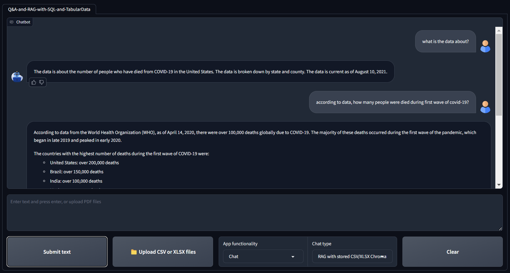

# Q&A-and-RAG-with-SQL-and-TabularData

`Q&A-and-RAG-with-SQL-and-TabularData` is a chatbot project that utilizes <u>Google Generative AI Model Gemini</u>, <u>Langchain</u>, <u>SQLite</u>, and <u>ChromaDB</u> and allows users to interact (perform <u>Q&A</u> and <u>RAG</u>) with SQL databases, CSV, and XLSX files using natural language.

**Key NOTE:** Remember to NOT use a SQL databbases with WRITE privileges. Use only READ and limit the scope. Otherwise your user could manupulate the data (e.g ask your chain to delete data).

## Features:
- Chat with SQL data.
- Chat with preprocessed CSV and XLSX data.
- Chat with uploaded CSV and XSLX files during the interaction with the user interface.
- RAG with Tabular datasets.

## Main underlying techniques used in this chatbot:
- LLM chains and agents
- Gemini Language Model for Chat
- Retrieval Augmented generation (RAG)

## Models used in this chatbot:
- Gemini-Pro: [Website](https://deepmind.google/technologies/gemini/pro/)

# Note : 
```
instructor
sentence-transformer == 2.2.2
```

- Please note that I have used HuggingfaceInstructorEmbeddings which is one of the finest Free embeddings models out there, but for that you have to install them using pip to your virtual environment or you can use OpenAI embedding model if you have paid APIs.
But this modules sometimes stuck you in **"dependency errors"**.
- Make sure you install proper versions of each module from requirements.txt file.

## Requirements:
- Operating System : Windows (used by me), Linux can also be used.
- Get your Gemini API key from [here](https://aistudio.google.com/app/apikey).

## Installation:
- Ensure you have Python installed along with required dependencies.
```
pip3 install --upgrade pip
conda create -p rag-venv python==3.9.19
git clone <the repository>
conda activate rag-venv
pip install -r requirements.txt
```
## Execution:

1. To prepare the SQL DB from a `.sql` file, Copy the file into `data/sql` directory and in the terminal, from the project folder, execute: (sqlite3 already added to requirements.txt)
```
pip install sqlite3
```

	Now create a database called `sqldb`:
```
sqlite3 data/sqldb.db
.read data/sql/<name of your sql database>.sql
```
Ex:
```
.read data/sql/Chinook_Sqlite.sql
```

	This command will create a SQL database named `sqldb.db` in the `data` directory. Verify that it created the database
```
SELECT * FROM <any Table name in your sql database> LIMIT 10;
```
Ex:
```
SELECT * FROM Artist LIMIT 10;
```

2. To prepare a SQL DB from your CSV and XLSX files, copy your files in `data/csv_xlsx` and in the terminal, from the project folder, execute:
```
python src/prepare_csv_xlsx_db.py.
```

	This command will create a SQL database named `csv_xlsx_sqldb.db` in the `data` directory.

3. To prepare a vectorDB from your CSV and XLSX files, copy your files in `data/for_upload` and in the terminal, from the project folder, execute:
```
python src/prepare_csv_xlsx_vectordb.py
```
This command will create a VectorDB in `data/chroma` directory.


------------

## How to use Chatbot : 
<h3><span style="color:red">Important</span></h3>

- To upload your datasets and chat with them during the interaction with the user interface: **Change the chat functioncality to `Process files`** <span style="color:red">please note It.</span>

- Upload you files and wait for the message indicating the the database is ready.
- **Switch back the chat functioncality to `Chat`**<span style="color:red">please note It.</span>
- **Change the RAG with dropdown to `Uploaded files`.** <span style="color:red">please note It.</span>
- Start chatting.


------------


## Chatbot User Interface
<div align="center">
  
</div>

## Databases:
- Diabetes dataset: [Link](https://www.kaggle.com/datasets/akshaydattatraykhare/diabetes-dataset?resource=download&select=diabetes.csv)
- Cancer dataset: [Link](https://www.kaggle.com/datasets/rohansahana/breast-cancer-dataset-for-beginners?select=train.csv)
- Chinook database: [Link](https://database.guide/2-sample-databases-sqlite/)

## Key frameworks/libraries used in this chatbot:
- Langchain: [introduction](https://python.langchain.com/docs/get_started/introduction)
- Gradio: [Documentation](https://www.gradio.app/docs/interface)
- Google GenerativeAI: [Developer quickstart](https://ai.google.dev/)
- SQLAlchemy [Documentation](https://www.sqlalchemy.org/)